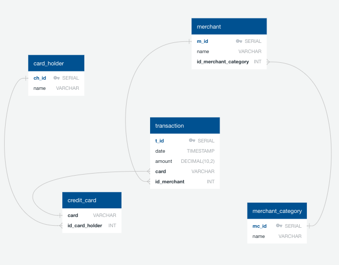

# Credit Card Transactions
# 1. Data Modeling and Engineering
Create an entity relationship diagram (ERD) by inspecting the provided CSV files.



# 2. Data Analysis

### A.) How can you isolate (or group) the transactions of each cardholder?

```sql
SELECT ch."name",cc."cc_card",t."amount",t."date",m."name",mc."name" 
FROM "transactions" AS t
INNER JOIN "credit_card" AS cc ON t."id_merchant" = cc."id_card_holder"
INNER JOIN "card_holder" AS ch ON cc."id_card_holder" = ch."ch_id"
INNER JOIN "merchant" AS m ON t."id_merchant" = m."m_id"
INNER JOIN "merchant_category" AS mc ON mc."mc_id" = m."id_merchant_category"
ORDER BY ch."name";
```

### B.) Consider the time period 7:00 a.m. to 9:00 a.m. 
* What are the 100 highest transactions during this time period?

```sql
SELECT amount, date
FROM transactions
WHERE date >= '2018-01-01 07:00:00' and date <= '2018-12-31 09:00:00'
ORDER BY amount DESC LIMIT 100;
```

* Do you see any fraudulent or anomalous transactions?

```

```

* If you answered yes to the previous question, explain why you think there might be fraudulent transactions during this time frame.

```

```

# 3. $2.00 Fraudsters
## Some fraudsters hack a credit card by making several small payments (generally less than $2.00), which are typically ignored by cardholders. Count the transactions that are less than $2.00 per cardholder. 

### A.) Is there any evidence to suggest that a credit card has been hacked? Explain your rationale.

```

```

# 4. Top 5  

### A.) What are the top five merchants prone to being hacked using small transactions?

```

```

#### B.) Once you have a query that can be reused, create a view for each of the previous queries.

```

```

# 5. Top customers fraudulent transactions

#### A.) Verify if there are any fraudulent transactions in the history of two of the most important customers of the firm. For privacy reasons, you only know that their cardholders' IDs are 18 and 2.
* Using hvPlot, create a line plot representing the time series of transactions over the course of the year for each cardholder. In order to compare the patterns of both cardholders, create a line plot containing both lines.

```

```

* What difference do you observe between the consumption patterns? Does the difference suggest a fraudulent transaction? Explain your rationale.

```

```

# 6. Q1 2018 Anomalous transactions
* Using Plotly Express, create a series of six box plots, one for each month, in order to identify how many outliers there are per month for cardholder ID 25.

```

```

* Do you notice any anomalies? Describe your observations and conclusions.

```

```
